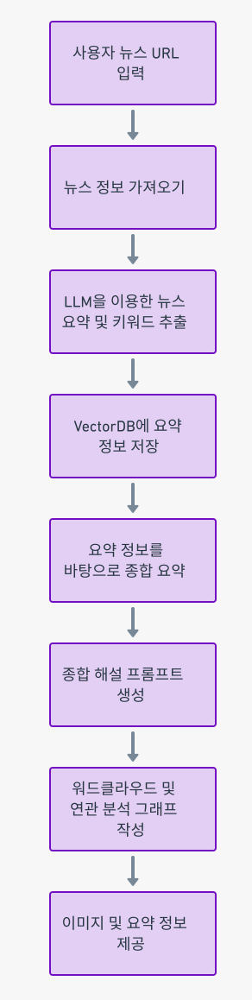

# 랭체인 에이전트(에코에이전트🧐)
랭체인 에이전트(에코에이전트🧐)는 랭체인의 뉴스를 요약하고, 주요 엔터티 및 키워드를 추출하여 사용자에게 제공하는 에이전트입니다.

## 1. 여러 뉴스 URL을 입력하여 실시간 뉴스 서비스 제공:

1. 사용자는 여러 뉴스의 URL을 입력한다.  
2. 에이전트가 해당 URL에서 뉴스 정보를 가져옵니다.  
3. 가져온 뉴스 정보를 바탕으로 `LLM (langchain)` 을 이용해 각각 테스트를 요약하고, 주요 엔터티 및 키워드 추출을 한다.  
4. 요약 한 정보는 `VectorDB(Pinecone)`에 저장한다. (관련된 문서를 가져와서 종합 해설을 할 때 추가 자료로 사용한다.)  
5. 요약한 정보를 하나의 document로 만들어서 다시 LLM을 이용해 종합 요약을 한다.   이 때, `"시사점", "연결성", "미래 예측", "비판점"` 등의 직접적인 프롬프트를 통해 종합 해설 프롬프트를 하도록 한다. 
6. python tool agent (langchain) 를 통해 `워드 클라우드`, `연관 분석 그래프` 를 작성하는 로직을 적용하고 이 이미지를 같이 보여준다.  

  

